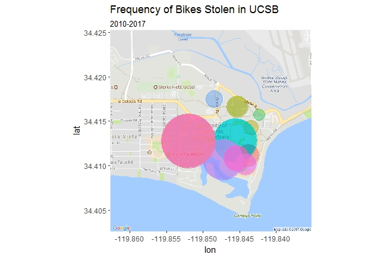

# Bikes Stolen in UCSB (Campus)

## Abstract
Bikes being reported stolen at the University of California, Santa Barbara has been an ongoing issue at the school. In this data visualization project, we map out which parts of the campus are the most vulnerable for bicycles, in an attempt to make students aware and hopefully more careful about where they park their bikes.  The programming language R was used to create this project. 

## Contributors
+ Eri Kawakami
+ Jun Ki Kwon (Jun)
+ Daniel Zeng
+ Mathew Peterschmidt

## Packages Required 
The required packages used in this project are: 
```
data.table
base
ggplot2
ggmap
plotly
plyr
```

## Methodology
In order to proceed with this project, we received our data from the UCSB Police Department. Most of our work went into cleaning and standardizing the data, as well as figuring out what bike parking spots on campus. 
We did not see the noticeable differences in the influence of each parking location until we saw it visualized on a map. 



## Conclusion
From the visualizations and interactive bar graphs, we conlcuded that the bike racks that were the most effected were the major ones on campus such as the UCSB Library and the SRB. 

## Sources Cited
A lot of this project was influenced from a prior project called: [Bikes Stolen in Isla Vista (2010 - 2016)](https://www.inertia7.com/projects/?q=isla+vista)
